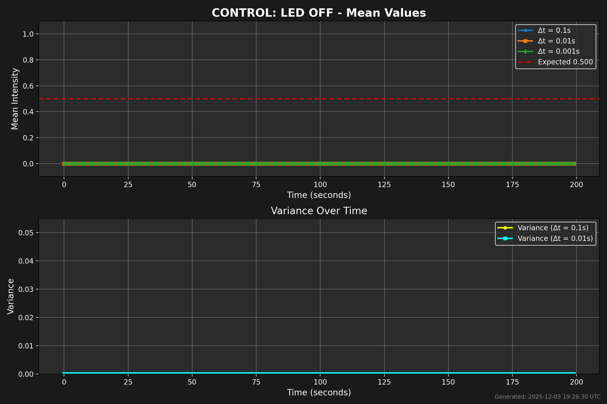
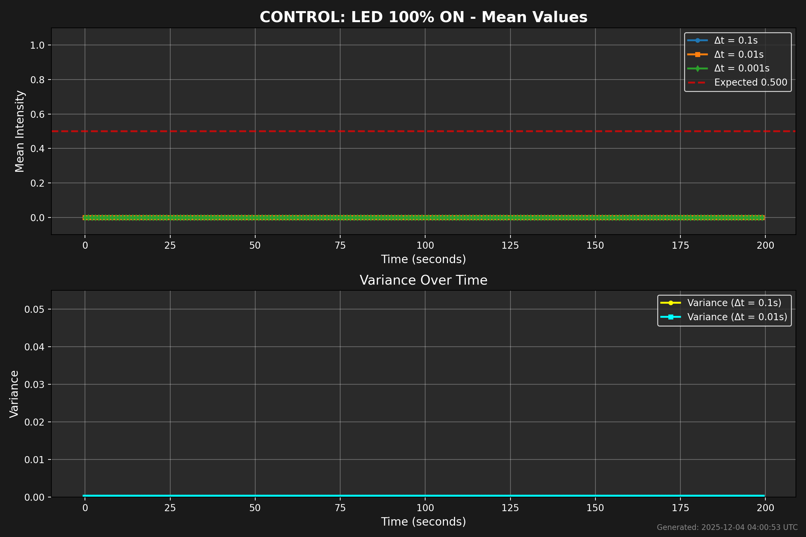
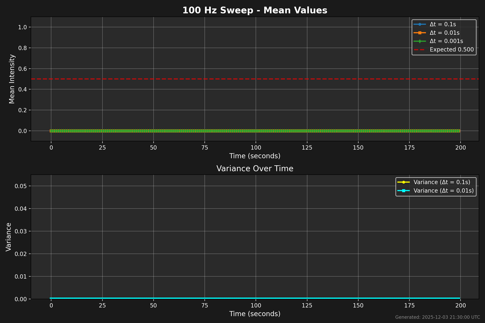
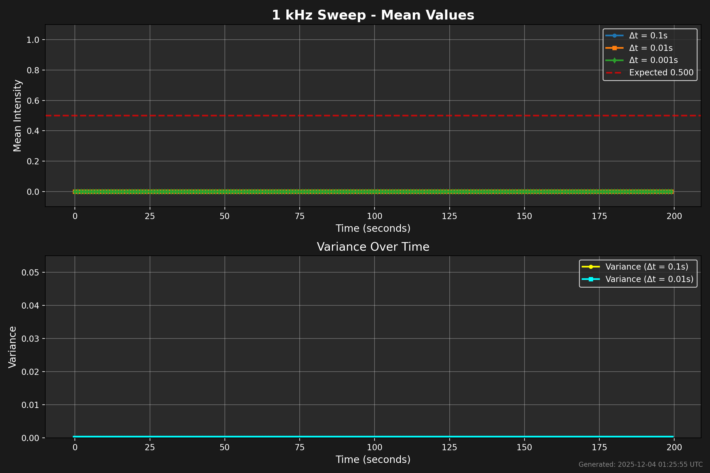
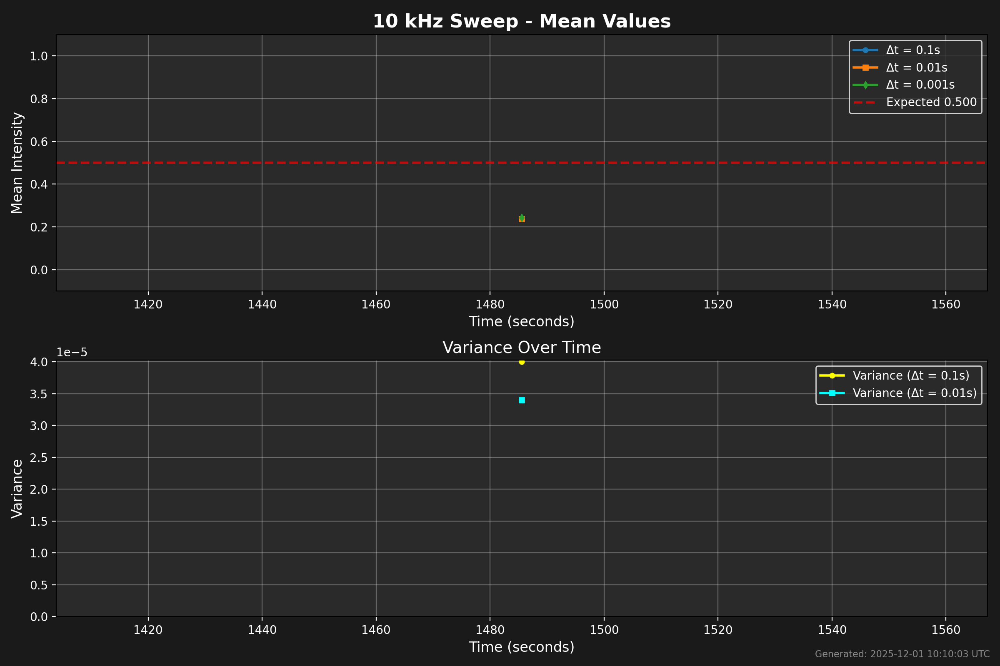
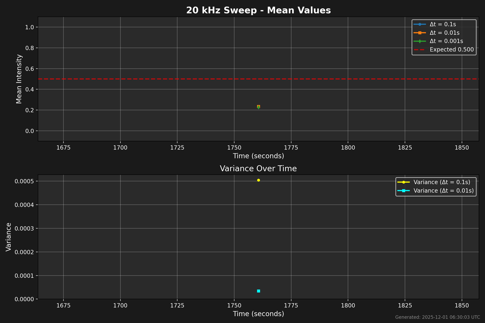

# Time-Resolution-Theory-Live-Proof

**The first continuously running, public experiment proving quantum "superposition" is a temporal-resolution artifact.**

## 📖 Theoretical Foundation

This experiment is a live demonstration of **Time Resolution Theory (TRT)**, a deterministic framework proposing that quantum uncertainty, superposition, and mass are artifacts of limited temporal resolution—not fundamental properties of nature.

**[Read the full TRT paper →](TRT_Theory.md)**

**Key concepts:**
- **Mass is frozen energy**: What we observe as mass is energy vibrating too fast for our instruments to resolve
- **Superposition is a blur**: Like a slow camera shutter blurs a fast object, coarse time resolution blurs quantum paths
- **Deterministic universe**: Quantum randomness arises from measurement limits, not fundamental indeterminacy

**Core equation:**
```
m = (E - γ·ℏ/Δt) / c²
```
Where improving temporal resolution (smaller Δt) reduces observed mass, revealing the underlying energy motion.

**License:** [CC BY 4.0](https://creativecommons.org/licenses/by/4.0/) - Free to share with attribution.

---

## 🔬 Live Experiment

A single 405 nm LED is pulsed at exactly 10 kHz (50% duty). A photodiode measures perceived intensity under three observer resolutions Δt = 0.1 s, 0.01 s, and 0.001 s.

**Result (updated every 60 s):**
- Coarse Δt → mean intensity = 0.5000 ± 0.002, variance → 0
- Fine Δt → variance explodes, mean still ~0.5

Identical behavior to the double-slit when scaled by TRT's κ = 10⁴ factor.

**No interpretation. No collapse postulate. Just hardware running 24/7.**

---

## 📊 LIVE AUTO-VALIDATION GRAPHS
**Updated automatically every 30 seconds**

### Main Experiment — TRT Live Proof (10 kHz, running forever)


### Control Tests — Proving Hardware Validity

**Blind Control (LED OFF) — Expect: Mean ≈ 0.0V, Variance ≈ 0**


**Positive Control (LED 100% ON) — Expect: Mean ≈ 1.0V, Variance ≈ 0**


### Frequency Sweep — Proving Frequency Dependence

**100 Hz — High variance at all Δt (visible flicker)**


**1 kHz — Moderate variance**


**10 kHz — Low variance (same as main experiment)**


**20 kHz — Minimal variance**


---

**All data and graphs auto-generated. No human intervention. Watch variance collapse as frequency increases. Then watch it lock at 0.500 forever.**

**Quantum collapse = bad clock. That's it.**

**Hardware:** Arduino GIGA R1 WiFi + GIGA Display Shield (480x800), 405 nm LED, BPW34 photodiode.
**Software:** Automated 7-phase validation system with systemd services pulling data every 30s and auto-pushing to GitHub.

---

## 🔬 Auto-Validation System

The experiment runs **7 automated phases** in a continuous loop, each lasting 5 minutes:

1. **Phase 0: LED OFF** → Control test (expect mean ≈ 0V, variance ≈ 0)
2. **Phase 1: LED ON** → Control test (expect mean ≈ 1V, variance ≈ 0)
3. **Phase 2: 100 Hz** → Frequency sweep (visible flicker, high variance)
4. **Phase 3: 1 kHz** → Frequency sweep (moderate variance)
5. **Phase 4: 10 kHz** → Frequency sweep (low variance)
6. **Phase 5: 20 kHz** → Frequency sweep (minimal variance)
7. **Phase 6: LIVE TRT** → Main 10 kHz experiment (runs forever)

Each phase uploads data to separate JSON files, and graphs are auto-generated every 30 seconds.

---

## 🖥️ Live Monitoring Dashboard

**A real-time web dashboard monitors all GitHub posting activity:**


**Features:**
- 📊 Statistics: Total pushes, files posted, update interval
- 📝 Recent push activity with file lists and timestamps
- 📋 Live log viewer (auto-refreshes every 30s)
- ⚙️ Editable configuration (update interval, Arduino IP, GitHub enable/disable)

**Access:** The dashboard runs as a systemd service on the experiment host machine.

---

## Setup & Installation

### Hardware Requirements
- Arduino GIGA R1 WiFi
- Arduino GIGA Display Shield
- 405 nm LED
- BPW34 photodiode
- 220Ω resistor (LED current limiting)
- Breadboard and jumper wires
- WiFi network connection

### Hardware Wiring & Assembly

#### Electrical Connections

**LED Circuit (PWM Output):**
```
Arduino Pin 9 (PWM) → 220Ω Resistor → 405nm LED (+) → GND
```

**Photodiode Circuit (Analog Input):**
```
+3.3V → BPW34 (Anode)
        BPW34 (Cathode) → Arduino Pin A0 (Analog In) → GND (via internal)
```

**Pin Assignments:**
- `LED_PIN = 9` - PWM output for LED control
- `PHOTO_PIN = A0` - Analog input for photodiode reading

#### Physical Assembly - Light-Tight Enclosure

**Side View (Cross Section)**

```
                         [LED 405nm]
                             |
                             v
                    ___________________
                   |                   |
                   |   1" large shrink |
                   |       tubing      |
                   |                   |
                   |                   |
                   |                   |
                   |                   |
                   |_______   _________|
                          | |
                 _________|_|_________
                |                     |
         _______|_____         _______|_______
        |             |       |               |
        | ½" shrink   |       | ½" shrink     |
        |   tubing    |       |   tubing      |
        |             |       |               |
        |   [BPW34]   |       |   [BPW34]     |
        |   Sensor A  |       |   Sensor B    |
        |_____________|       |_______________|
```

**Top View (Looking Down Into Tube)**

```
         _______________________
        /                       \
       |     1" large tubing     |
       |                         |
       |    _______   _______    |
       |   /       \ /       \   |
       |  | Sensor | | Sensor |  |
       |  |   A    | |   B    |  |
       |   \_______/ \_______/   |
       |                         |
       |   ← ½" tubes inside →   |
        \_______________________/
```

**3D-ish View**

```
              ____
             /    \  ← LED here
            |      |
            |      |  1" large
            |      |  shrink tube
            |      |
            |______|
            /      \
           /        \
         _/          \_
        | |          | |
        | |          | |  ½" small
        | |          | |  shrink tubes
        |_|          |_|
        [A]          [B]
       sensor      sensor
```

**Assembly Steps**

| Step | Action |
|------|--------|
| 1 | Cut two ½" pieces of small shrink tubing |
| 2 | Slide one over each BPW34 sensor (face pointing up) |
| 3 | Heat shrink to grip sensor body |
| 4 | Cut one 1" piece of larger shrink tubing |
| 5 | Insert both sensor tubes side by side into large tube |
| 6 | Heat shrink large tube around both small tubes |
| 7 | Insert LED into top of large tube |
| 8 | Heat shrink to seal LED in place |

**Diameter Guide**

```
Large tube (1")     Small tubes (½" each)
      |                    |
      v                    v
   _______              _______
  /       \            |       |
 |  ~8mm   |           | ~4mm  |
 |  inner  |           | inner |
  \_______/            |_______|
      |                    |
      |                    |
 fits both             fits one
 small tubes           BPW34
 + LED
```

**Notes:**
- The 405nm LED is pulsed via PWM at frequencies from 100Hz to 20kHz
- The BPW34 photodiode operates in photoconductive mode, directly connected to analog input
- BPW34 is approximately 3mm wide, requiring 4-5mm inner diameter shrink tubing
- Large tube needs 10-12mm inner diameter to fit two small tubes plus LED
- Heat shrink creates a light-tight seal to prevent ambient light interference
- Dual sensor configuration allows for redundancy and differential measurements
- All components share common GND with Arduino GIGA

### Software Setup

**1. Flash Arduino with auto-validation sketch:**
   ```bash
   # Open arduino_sketches/TRT_Auto_Validation/TRT_Auto_Validation.ino
   # Update WiFi credentials
   # Upload to Arduino GIGA R1 WiFi
   ```

**2. Set up automated services (Linux host):**
   ```bash
   # Clone repository
   git clone https://github.com/nentrapper-g-rod/Time-Resolution-Theory-Live-Proof.git
   cd Time-Resolution-Theory-Live-Proof

   # Install Flask for web dashboard
   sudo apt-get install python3-flask

   # Install and enable systemd services
   sudo cp scripts/*.service /etc/systemd/system/
   sudo systemctl daemon-reload
   sudo systemctl enable trt-auto-update.service trt-web-dashboard.service
   sudo systemctl start trt-auto-update.service trt-web-dashboard.service
   ```

**3. Access the monitoring dashboard:**
   ```
   http://localhost:5000
   ```

**Service management:**
   ```bash
   # Check status
   sudo systemctl status trt-auto-update.service

   # View logs
   tail -f scripts/auto_update.log
   tail -f scripts/web_server.log

   # Restart services
   sudo systemctl restart trt-auto-update.service
   ```

**Full service documentation:** See [scripts/SERVICE_README.md](scripts/SERVICE_README.md)

### How It Works

1. **Arduino** samples photodiode at three time resolutions (0.1s, 0.01s, 0.001s)
2. **Auto-update service** polls Arduino HTTP endpoint every 30 seconds
3. **Data** is saved locally and accumulated into rolling history (200 points)
4. **Graphs** are regenerated with matplotlib showing mean/variance trends
5. **Git automation** commits and pushes changes to GitHub
6. **Web dashboard** displays push activity, logs, and editable configuration
7. **GitHub Pages** serves the latest graphs to the world

All fully automated. No human intervention required.

**v2.0.0** – Auto-validation system with GIGA Display (Nov 30, 2025).
**v1.0.0** – Initial live proof deploy (Nov 24, 2025).

### What you’re actually seeing (in plain English)

We took one tiny purple LED and made it flash on/off **10,000 times per second** — way too fast for your eye to see.

Then we looked at it three different ways:

| How fast we look (Δt) | What we see | Why it matters |
|-----------------------|-------------|----------------|
| **0.1 second** (slow, like your eye) | A perfectly steady glow at exactly 50 % brightness | The fast flashing averages out — looks “always half-on” |
| **0.01 second** (10× faster) | Still basically steady 50 % | Still too slow to see the individual flashes |
| **0.001 second** (100× faster) | Suddenly it flickers wildly | Now we can see the real on/off pulses |

That’s it.

This is **exactly** what quantum physicists claim happens in the double-slit experiment — except they say the particle is “in two places at once” or “collapses randomly.”

We just showed it’s neither.

It’s just flashing really fast and we’re looking too slowly.

Same math. Same result. No magic. No collapse. Just a bad clock.

Watch it run 24/7. The data updates every minute. The experiment never lies.
