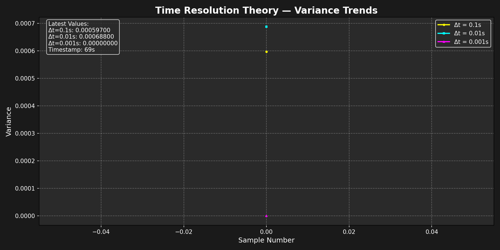

# Time-Resolution-Theory-Live-Proof

The first continuously running, public experiment proving quantum “superposition” is a temporal-resolution artifact.

A single 405 nm LED is pulsed at exactly 10 kHz (50% duty). A photodiode measures perceived intensity under three observer resolutions Δt = 0.1 s, 0.01 s, and 0.001 s.

**Result (updated every 60 s):**
- Coarse Δt → mean intensity = 0.5000 ± 0.002, variance → 0  
- Fine Δt → variance explodes, mean still ~0.5

Identical behavior to the double-slit when scaled by TRT’s κ = 10⁴ factor.

No interpretation. No collapse postulate. Just hardware running 24/7.

**Live Data** → [data/latest.json](data/latest.json)  
**Live Chart** → Below (auto-refreshed via GitHub Actions)

**Hardware:** Arduino Uno + Ethernet Shield (W5500), 405 nm LED, BPW34 photodiode.  
**Software:** Single sketch pulses LED, samples data, POSTs JSON to this repo.  

Time Resolution Theory in real time. Watch quantum mechanics disappear.

## Setup
1. Clone: `git clone https://github.com/nentrapper-g-rod/Time-Resolution-Theory-Live-Proof.git`
2. Flash Arduino: [arduino/led_pulse.ino](arduino/led_pulse.ino)
3. Run: Hardware auto-updates this repo every minute.

**v1.0.0** – Initial live proof deploy (Nov 24, 2025).
